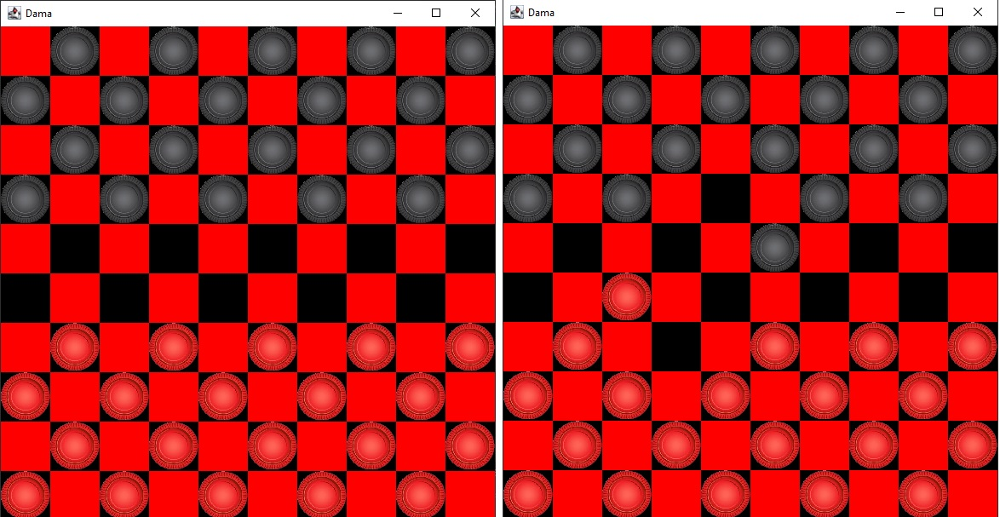

<h1>Checkers</h1>
This project introduces the board game Checkers. The game contains a board consisting of red and black fields. The pieces can move only on the black fields. When a player loses all his pieces, the game ends and the player whose pieces are left on the board wins. When the game starts, the normal pieces appear in the first three rows on both sides, on the black fields. Each player owns 20 pieces of his color.
There are two types of pieces in Checkers, the regular piece (also called a Dog, Stone, Jack) and the Queen (sometimes called a King). The pawn is able to move one shelf forward on the diagonal - the so-called move. In checkers, the first player to move a piece is always the red player. Next, the black player takes his turn. 
The only exception is the jump. A player jumps with a piece if he is on the move, there is an enemy piece on the diagonal in front of or behind the piece, and there is a free shelf behind the enemy piece, also diagonal, on which the jumping piece subsequently jumps. After the jump, the jumped piece is removed from the board and cannot be played with further.
The player cannot jump a piece of his own colour. The pieces can also jump more than once in one turn if the above conditions are met. 
At the beginning of the game, only pieces of the ordinary piece type are on the board.
 The queen is a special type of piece that can move any number of spaces on the diagonal. A pawn becomes a queen if it reaches the last row of fields of the counter game. Other rules and abilities for a queen are the same as for a dog.
In my checkers, Force Jump is implemented. This means that if it is possible to jump with a piece, the player is REQUIRED to jump. If he doesn't, he loses a piece. This rule also applies to multiple jumps with the same piece.
If two pieces can jump at the same time and the player does not jump with a piece, he loses both pieces. If he jumps with at least one of them, he does not lose either of them.

